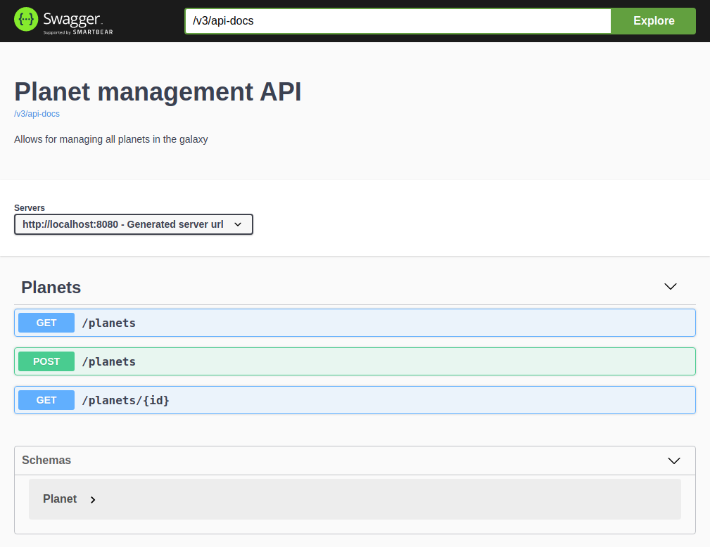

# Maven Springdoc client code generation example


This project is a sample REST service documented using Springdoc OpenAPI, with automatic Angular client code generation
done using openapi-generator-maven-plugin and springdoc-openapi-maven-plugin.

To learn how to generate client code from Spring Boot using Maven and Springdoc OpenAPI, read the post:

[TBD]

## Getting Started

1. Clone the repository

```bash
$ git clone https://github.com/daniel-frak/client-code-generation-maven-springdoc
```

2. Build the application

```bash
$ mvn clean install
```

## Built With

* Java 11
* [Spring Boot 2.7.0](https://start.spring.io/)
* [Maven](https://maven.apache.org/)
* [Springdoc OpenAPI](https://github.com/springdoc/springdoc-openapi/)

## Screenshots



## License

This project is licensed under the MIT License - see the [license details](https://opensource.org/licenses/MIT).